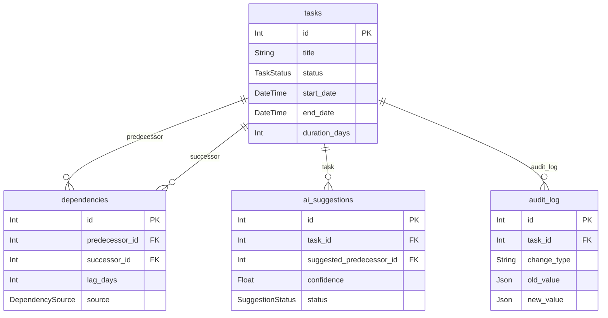

# TaskFlow Pro: Documentation

## 1. Overview
TaskFlow Pro is a Kanban-based project management tool with an integrated Directed Acyclic Graph (DAG) scheduling engine. Its standout feature is the **What-If Simulator**, which allows users to tentatively explore how delays or changes to a single task will recursively impact downstream dependencies and final delivery dates before committing to the schedule.

## 2. System Architecture
- **Frontend:** React (Vite) utilizing `@dnd-kit/core` for drag-and-drop interactions.
- **Backend:** Node.js with Express for REST API routing.
- **Database & ORM:** PostgreSQL database managed via Prisma ORM for schema and migrations.
- **Communication:** The frontend communicates with the backend REST API via standard HTTP `fetch` requests, relying on environment variables (`VITE_API_URL`) to determine the base URL.
- **DAG Engine:** Scheduling logic is strictly decoupled into a shared module (`server/services/dagEngine.js`). The real update path (`PATCH /api/tasks/:id`) and the simulate path (`POST /api/simulate`) both call identical core algorithms (`detectCycle`, `propagateSchedule`, `computeReadyBlocked`, `rollbackRecheck`) to guarantee that simulated projections exactly match real-world consequences.

```mermaid
flowchart TD
    subgraph Frontend [React / Vite]
        UI[Kanban Board UI]
        Dnd[Dnd-Kit Engine]
        UI <--> Dnd
    end
    
    subgraph Backend [Node.js / Express]
        API[Express Router]
        DAG[dagEngine.js]
        AI[aiService.js (Groq LLM)]
        API --> DAG
        API --> AI
    end
    
    subgraph Database [PostgreSQL]
        Prisma[(Prisma ORM)]
    end
    
    UI <-->|HTTP / REST| API
    DAG <--> Prisma
```

## 3. Data Model
The PostgreSQL database is defined by `server/prisma/schema.prisma` and contains the following tables:
- **`tasks`**: Stores core task information (`id`, `title`, `description`, `status`, `start_date`, `end_date`, `duration_days`, `column_position`).
- **`dependencies`**: A plain edge table linking tasks (`predecessor_id`, `successor_id`, `lag_days`, `source`). It acts as a strict junction table enforcing unique constraints on the `(predecessor_id, successor_id)` pair.
- **`ai_suggestions`**: Stores unconfirmed AI recommendations (`task_id`, `suggested_predecessor_id`, `confidence`, `rationale`, `status`). It is intentionally isolated from the `dependencies` table to prevent AI hallucinations from corrupting the active DAG until a human explicitly reviews and sets the status to `accepted`.
- **`audit_log`**: Records historical modifications (`task_id`, `change_type`, `old_value`, `new_value`, `timestamp`).



## 4. Core Algorithms
All scheduling algorithms reside in `server/services/dagEngine.js`:
- **Cycle Detection (`detectCycle`)**: Uses a Depth-First Search (DFS) with a recursion stack to reject any edge creation (`A -> B -> C -> A`) that would violate the DAG structure.
- **Ready/Blocked Computation (`computeReadyBlocked`)**: Dynamically flags a task as `ready` only if *all* immediate predecessors possess a `done` status. Otherwise, it is `blocked`.
- **No-Compounding Propagation (`propagateSchedule`)**: Uses a Critical Path Method (CPM) topological sort. When shifting dates, it takes the **MAX** (not sum) of `(predecessor's end_date + lag)` across all incoming edges. 
  - *Diamond Example:* If A -> B -> D and A -> C -> D, and Task A is delayed by 3 days, both paths pass the 3-day delay to D. By taking the maximum of incoming dates, D is correctly delayed by exactly 3 days total, preventing a compounding 6-day error.
- **Rollback Re-checking (`rollbackRecheck`)**: When a task reverts from `done` to an incomplete status, this recursively visits descendants using BFS to recalculate their states, flipping downstream tasks back to `blocked`.

## 5. API Design
- `GET /health` : Verifies backend uptime.
- `GET /api/tasks` : Retrieves all tasks.
- `POST /api/tasks` : Creates a new task.
- `PATCH /api/tasks/:id` : Updates an existing task (drag-and-drop column status, duration).
- `POST /api/dependencies` : Creates a new directed edge between two tasks.
- `GET /api/dependencies` : Retrieves the DAG edges.
- `DELETE /api/dependencies/:id` : Removes an edge.
- `GET /api/audit-log/:taskId` : Retrieves the historical changelog for a specific task.
- `POST /api/simulate` : Calculates the exact impact of a day-delay on a task without writing to the DB.
- `POST /api/simulate/nl` : Parses a natural language prompt (via Groq LLM) into a structured `{ taskId, deltaDays }` payload, then runs `/api/simulate`.
- `GET /api/ai-suggestions` : Retrieves pending AI dependency suggestions.
- `PATCH /api/ai-suggestions/:id` : Accepts or rejects an AI dependency suggestion.

## 6. AI/LLM Integration
The application integrates the Groq LLM provider (using native Node.js `fetch` against Groq's OpenAI-compatible `/chat/completions` endpoint).
1. **Dependency Suggestion**: When a task is created, the LLM analyzes titles/descriptions to propose implicit dependencies. To safeguard the DAG, these suggestions remain pending in `ai_suggestions` and strictly require human intervention (`PATCH /api/ai-suggestions/:id`) to be converted into real edges.
2. **Natural Language What-If**: Users can type queries like *"What if testing slips by a week?"* The LLM securely parses the intent into deterministic parameters. 
**Safety:** The LLM is strictly confined to intent parsing and qualitative summary generation. It *never* calculates dates or corrupts the schedule; mathematical calculations are exclusively handled by the deterministic `dagEngine`.

## 7. Key Assumptions and Limitations
- **Critical Path Highlighting:** The optional UI feature to visually highlight the critical path on the Kanban board is currently **NOT implemented**.
- **Single-User Architecture:** The application assumes a single primary user or small localized team. There is no real-time WebSocket sync (e.g., Socket.io); concurrent edits may cause frontend staleness requiring a refresh.
- **LLM Rate Limiting:** The app operates on Groq's free tier, which occasionally yields `429 Too Many Requests`. The backend mitigates this via standard parsing of `Retry-After` headers and an in-memory debouncing cache, but intense rapid usage will trigger UI rate-limit warnings.

## 8. Known Failure Cases
- **Drag-and-Drop Native Conflict:** Clicking and dragging cards previously triggered the browser's native text-selection engine, breaking the drag gesture. This was resolved by appending an `activationConstraint: { distance: 8 }` to the `dnd-kit` PointerSensor and applying `user-select: none` via CSS.
- **CSS Syntax Corruption:** A stray PostCSS parse error stemming from PowerShell UTF-16 file encoding corrupted `App.css`. The file was rebuilt with correct UTF-8 encoding to restore board styling.
- **Unbounded Simulation Prompts:** Early iterations of the LLM summary would hallucinate vague date estimates (e.g. "about a week"). Prompts were hardened with "CRITICAL RULES" to strictly quote exact `delta_days` integers.

## 9. Testing Summary
The core scheduling logic is verified via a Jest test suite (`server/tests/dagEngine.test.js`), checking:
- **Cycle Detection**: Validates successful edge acceptance and explicit rejection of `A -> B -> C -> A` cycles without mutating the graph.
- **No-Compounding**: Confirms the diamond-convergence scenario does not double-count delays.
- **State Transitions**: Validates exact `Ready`/`Blocked` computations and accurate multi-level downstream propagation.
- **Rollback Behavior**: Ensures descendants correctly re-block if an upstream prerequisite loses its `done` status.

## 10. Deployment
The application is structured for a decoupled deployment:
- **Backend & Database**: Configured for deployment on Render, connecting securely via `DATABASE_URL` to a PostgreSQL instance. It binds to `0.0.0.0` and securely configures CORS using `CLIENT_URL`.
- **Frontend**: Designed for Vercel, pointing API requests back to the Render instance using the `VITE_API_URL` environment variable.
